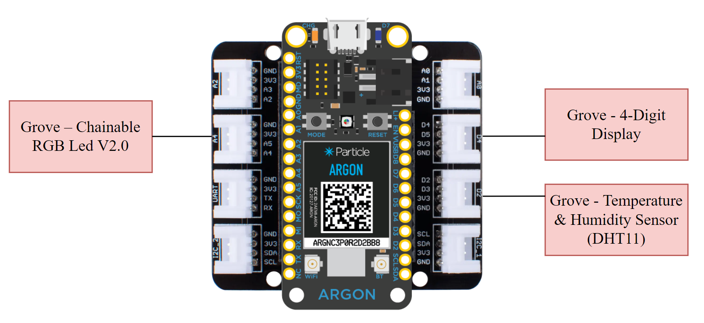

# User Interaction with IoT Devices using Augmented Reality
Augemented Reality Application to control IoT devices

## IoT Hardware Setup

## Connect Device to Internet
1. Setup hardware connections
2. Download [Particle IoT App](https://play.google.com/store/apps/details?id=io.particle.android.app&hl=en_US&gl=US) on mobile device and sign in
4. Add Particle Argon device
5. Connect Particle to network from device settings

## Installing Device Firmware
1. Go to [Particle Console](https://console.particle.io/) and sign in
2. Go to Web IDE and select device
3. Copy and paste [firmware](https://github.com/ECE-597SD/Project-3/blob/main/src/argon/ARIoT.ino) from repo into Web IDE
4. Flash onto device

## App Installation Instructions
Android: Download .apk file to phone and install

iOS: Download app from Apple App Store (not published yet)

## Developing Firmware
Isolate the top-level data and functionality of your IoT device. Connect device into Particle Mesh Grove Shield. 

In setup(), expose variables to track and functions to call using Particle API:
- variables: Particle.variable({var_name})

- functions: Particle.function({func_name})

Implement functions to call and variables to update. In mainloop, call variable functions to update them. See [argon code](https://github.com/ECE-597SD/Project-3/blob/main/src/argon/ARIoT.ino) as template.
